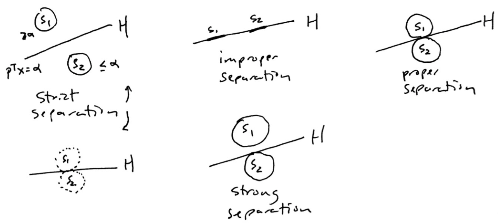
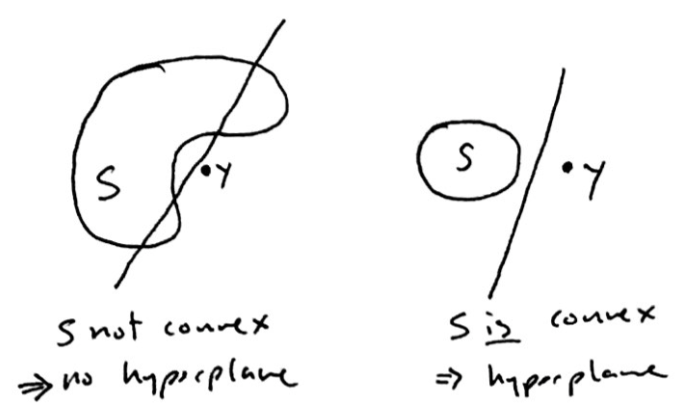
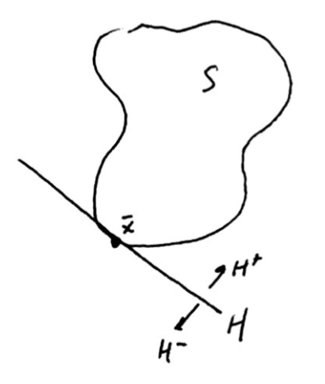
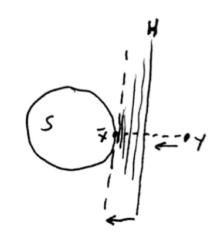
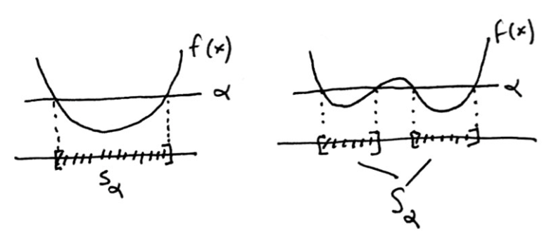
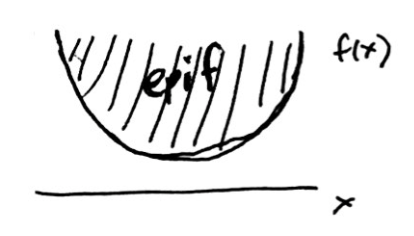
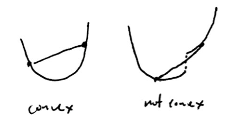

---
title:  'Nonlinear Optimization Lecture 4'
date: Thursday, January 21, 2016
author: Garrick Aden-Buie
...

# Last time

Theorem
:    $S$ is a non-empty, closed convex set and $y \not \in S$, then $\bar x \in S$ is the min. distance point. And $(y - \bar x)^T(x - \bar x) \leq 0,\;\forall x \in S$.

# Separation

Let $S_1, S_2 \subset \mathbb{R}^n$ and $H = \{x \in \mathbb{R}^n \colon p^Tx = \alpha \}$.

**Definition.** $H$ *separates* $S_1$ and $S_2$ if

$$\begin{aligned}
p^T x \geq \alpha & &\forall x \in S_1 \\
p^T x \leq \alpha & &\forall x \in S_2
\end{aligned}$$

$H$ *strictly* separates $S_1$ and $S_2$ if

$$\begin{aligned}
p^T x > \alpha & &\forall x \in S_1 \\
p^T x < \alpha & &\forall x \in S_2
\end{aligned}$$

$H$ *strongly* separates $S_1$ and $S_2$ if

$$\begin{aligned}
p^T x \geq \alpha + \epsilon & &\forall x \in S_1 \\
p^T x \leq \alpha & &\forall x \in S_2
\end{aligned}$$

for some $\epsilon > 0$.

Theorem
:    If $S$ is a non-empty, closed, convex set and $y \not\in S$. Then there exists a hyperplane that strongly separates $S$ and $\{y\}$ (singleton).

*Proof.* There exists an $\bar x \in S$ such that $(y - \bar x)^T(x - \bar x) \leq 0,\;\forall x \in S$.

Let

$$\begin{aligned}
p = y - \bar x & &\\
\Rightarrow p^T (x - \bar x) \leq 0 & &\forall x \in S \\
p^T x \leq p^T \bar x & &\forall x \in S \\
p^T x \leq \alpha & &\forall x \in S
\end{aligned}$$

where $\alpha = p^T \bar x$.

Now we want to show that $$p^T x \geq \alpha + \epsilon\;\;\forall x = y$$ for some $\epsilon > 0$, or $$p^T y > \alpha$$.

$$\begin{aligned}
p^T y - \alpha \;(> 0)\\
= (y - \bar x)^T y - (y - \bar x)^T \bar x \\
= (y - \bar x)^T (y - \bar x) \\
= \Vert y - \bar x \Vert^2 > 0
\end{aligned}$$

(Note that all norms satisfy $\Vert a \Vert = 0$ iff $a = 0$.)

This proves the two conditions listed above for *strong separation*.

# Supporting Hyperplane

Let $S \in \mathbb{R}^n, \; S \neq \emptyset$, $\bar x \in \delta S$, and $H = \{x \in \mathbb{R}^n \colon p^T (x - \bar x) = 0\}$. Note that $H$ is a hyperplane that passes through $\bar x$ because setting $x = \bar x$ satisfies $p^T (x - \bar x) = 0$.

$$\begin{aligned}
H^+ &= \{ x \in \mathbb{R}^n \colon p^T (x - \bar x) \geq 0\} \\
H^- &= \{ x \in \mathbb{R}^n \colon p^T (x - \bar x) \leq 0\}
\end{aligned}$$

$H$ is a *supporting hyperplane* for $S$ at $\bar x$ if $S \subset H^+$ or $S \subset H^-$.

Theorem
:    Let $S \subset \mathbb{R}^n$ be a closed, non-empty convex set, $y \not\in S$ and $\bar x \in S$ is the closest point to $y$.

    Then there exists a supporting hyperplane at $\bar x$.

*Intuition*: Consider $y$ and $\bar x$. If you move $y$ closer and closer to $\bar x$, then eventually you move the hyperplane up to the boundary of $S$. This "process" would converge to the supporting hyperplane.

# Convex Functions

$f$ is convex on $S$ if

$$\begin{aligned}
f(\lambda x_1 + (1 - \lambda)x_2) \leq \lambda f(x_1) + (1 - \lambda) f(x_2) \\
\forall x_1, x_2 \in S,\;\;\lambda \in [0,1]
\end{aligned}$$

## Level Set

Let $\alpha \in \mathbb{R}$, then $S_\alpha = \{x \in S \colon f(x) \leq \alpha\}$ is the level set.

Theorem
:    If $f$ is convex on $S$, then $S_alpha$ is a convex set for all $\alpha \in \mathbb{R}$.

*Proof*. Let $x_1, x_2 \in S_alpha$ and $\lambda \in [0,1]$. We need to show that $\lambda x_1 + (1 - \lambda)x_2 \in S_alpha$ for all $\alpha \in \mathbb{R}$.

We know that

$$\begin{aligned}
f(x_1) &\leq \alpha \\
f(x_2) &\leq \alpha \\
\Rightarrow \lambda f(x_1) &\leq \lambda \alpha \\
(1 - \lambda) f(x_2) &\leq (1 - \lambda) \alpha
\end{aligned}$$

$f$ is convex, so

$$\begin{aligned}
f(\lambda x_1 + (1 - \lambda) x_2) &\leq \lambda f(x_1) + (1 - \lambda)f(x_2) \\
&\leq \lambda \alpha + (1 - \lambda) \alpha \\
&= \alpha
\end{aligned}$$

## Epigraph

**Definition.** An *epigraph* of $f = \mathrm{epi} f = \{(x,y) \colon x \in \mathbb{R}^n, y \in \mathbb{R}^1, y \geq f(x) \}$.

Thus, $f \colon \mathbb{R}^n \rightarrow \mathbb{R}$ and $\mathrm{epi} f \subset \mathbb{R}^{n+1}$.

Theorem
:    $f \colon \mathbb{R}^n \rightarrow \mathbb{R}$. $f$ is a convex function $\Leftrightarrow \mathrm{epi} f$ is a convex set.

*Proof.* **Homework assignment**. Sketch: show $\Rightarrow$ and then show $\Leftarrow$. Intuition, if you have a non-convex function, then clearly $\mathrm{epi} f$ is going to be a non-convex set.

# Derivatives

When we talk about minimizing functions, $\mathrm{min} f(x)$, then the most obvious thing to do is to take the first derivative of $f$ and setting equal to zero, $f^\prime (x) = 0$.

## Partial Derivative and Gradient

Consider

$$\lim_{\lambda \rightarrow 0} \frac{f(x + \lambda e_i) - f(x)}{\lambda}$$

where $e_i$ is the $i$^th^ unit vector $= [0 \dots 1 \dots 0]^T$ with 1 at $i$^th^ element.

If the above limit exists

$$\frac{\partial f}{\partial x_i}(x) = \lim_{\lambda \to 0} \frac{f(x + \lambda e_i) - f(x)}{\lambda}$$

(which is the partial derivative of $f(x)$ with respect to $x_i), then the *gradient* of $f$ at $x$ is

$$\nabla f(x)=\begin{bmatrix} \frac { \partial f }{ \partial x_{ 1 } } (x) \\ \vdots  \\ \frac { \partial f }{ \partial x_{ n } } (x) \end{bmatrix} \in \mathbb{R}^n$$

(Note that in the single-variable case, we would typically have $\Delta x$ in the denominator. But the multi-directional case, this term would be a vector. So we need to rely on the partial derivative instead.)

## Directional Derivative

For any $d \in \mathbb{R}^n$ the *directional derivative* of $f$ in the direction $d$ is

$$f^\prime (x; d) = \lim_{\lambda \to 0^+} \frac{f(x + \lambda d) - f(x)}{\lambda}$$

**Def.** $f$ is *differentiable* at $x$ if and only if $\nabla f(x)$ exists and $\nabla f(x)^T d = f^\prime (x;d)$ for all $d \in \mathbb{R}^n$. This is *Gateaux-differentiability*.

We will be using this definition many times in discussing optimality conditions.

Theorem
:    Given $f \colon \mathbb{R}^n \to \mathbb{R}$ is convex and $\bar x \in \mathbb{R}^n, d \in \mathbb{R}^n$ a non-zero direction.

    Then the directional derivative $$f^\prime (\bar x; d)$$ exists.

*Remark.* Can a convex function be discontinuous on its own domain? (Answer is no.)

*Remark.* Can a convex function be non-differentiable? (Answer: yes, consider $y = \vert x \vert$. Notice that in this case, $y$ is not differentiable at one point, but the *directional* derivative does exist. The directional derivative is a more "general" derivative.)

## Taylor Expansion

Given $f(x) \colon \mathbb{R}^n \to \mathbb{R}$:

1. $f(x) = f(\bar x) + f^\prime (\bar x)(x - \bar x) + \frac{1}{2!} f^{''}(x)(x - \bar x)^2 + \cdots$
2. $f(x) = f(\bar x) + (x - \bar x)^T \nabla f(\bar x) + \frac{1}{2!}(x - \bar x)^T H(x)(x - \bar x) + \cdots$
    - Where $\nabla f(\bar x)$ is the gradient and $H(x)$ is the Hessian (look up!)

Precisely the $(\cdots)$ terms in (2) is a function $\Vert x - \bar x \Vert^2 \cdot \alpha (\bar x; x - \bar x)$ and $lim_{x \to \bar x} \alpha (\bar x; x - \bar x) = 0$.
