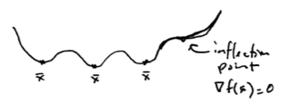
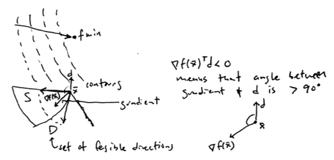
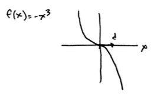

---
title:  'Nonlinear Optimization Lecture 9'
date: Thursday, February 11, 2016
author: Garrick Aden-Buie
...

# Last Lecture

$d$ is a vector $[\nabla f(\bar x)]^T d < 0 \Rightarrow d$ is a *descent direction*.

Example: $d = - \nabla f(\bar x)$

# Necessary Conditions

## Theorem

$f \colon \mathbb{R}^n \to \mathbb{R}$ differentiable at $\bar x$.
If $\bar x$ is a local minimum, then $\nabla f(\bar x) = 0$ (necessary condition).

*Proof.* Suppose not, i.e. assume $\nabla f(\bar x) \neq 0$.
Let $d = - \nabla f(\bar x)$.
Then $$[\nabla f(\bar x)]^T d = - \Vert \nabla f(\bar x) \Vert^2 < 0$$.

This means that $d$ is a descent direction at $\bar x$.
Note that the inequality is strict because we assumed that $\nabla f(\bar x) \neq 0$.
Then,

- $\exists \delta > 0 \colon f(\bar x + \lambda d) < f(\bar x)$, $\forall \lambda \in (0,\delta)$
- $\exists \epsilon > 0 \colon f(x) > f(\bar x)$, $\forall x \in N_\epsilon(\bar x)$

Then choose a small $\delta$ such that $\bar x + \lambda  d \in N_\epsilon(\bar x)$.
$\rightarrow$ contradiction.

*Remark.* This is true for *Unconstrained* problems. For *constrained* problems the above is not necessarily true.

## Theorem

$f \colon \mathbb{R}^n \to \mathbb{R}$ twice-differentiable at $\bar x$.

If $\bar x$ is a local minimum, then $\nabla f(\bar x) = 0$ and $H(\bar x)$ is PSD (necessary condition).

*Proof.* Easy to prove using Taylor Expansion.

# Sufficient Conditions

## Theorem

$f \colon \mathrm{R}^n \to \mathrm{R}$ and $H(\bar x)$ PD, then $\bar x$ is a **strict local minimum**.

**Def.** *Strict local minimum*: $\exists \epsilon > 0$ such that $f(\bar x) < f(x),\;\forall x \in N_\epsilon(\bar x)$

*Remark.* When we are considering $\bar x$, we don't know yet if it is a local minimum.
But if you find that the above conditions hold, then you know that $\bar x$ is a local minimum.
In the above necessary conditions, you don't necessarily know that $\bar x$ is a local minimum if the conditions hold, just that **if** $\bar x$ is a local minimum, those properties will be true.

*Remark.* Also notice that there is no convexity assumptions in the above, only differentiability.

## Theorem

$f \colon \mathrm{R}^n \to \mathrm{R}$, pseudoconvex at $\bar x$.

$\bar x$ is a **global minimum** if and only if $\nabla f(\bar x) = 0$.

This is one of the great properties of pseudoconvex functions. Note that pseudoconvex functions are by definition differentiable.

*Proof.* ($\Rightarrow$) Global min $\Rightarrow$ local min $\Rightarrow \nabla f(\bar x) = 0$.

($\Leftarrow$) $f$ is pseudoconvex at $\bar x$ means that

$$\begin{aligned}
\nabla f(\bar x)^T (\bar x - x) \geq 0 &\Rightarrow f(x) \geq f(\bar x)  &&\forall x \in \mathbb{R}^n \\
\nabla f(\bar x) = 0 &\Rightarrow \nabla f(\bar x)^T (\bar x - x) \geq 0 &&\forall x \in \mathbb{R}^n \\
&\Rightarrow f(x) \geq f(\bar x) &&\forall x \in \mathbb{R}^n
\end{aligned}$$

The idea of pseudoconvex functions motivates proofs, in that many proofs rely on the first step above.

# Summary

- Necessary Conditions
    - $\bar x$ local min $\Rightarrow \nabla f(\bar x) = 0,\; H(\bar x)$ PSD
    - $\bar x$ local min $\Rightarrow \nabla f(\bar x) = 0,\; H(\bar x)$ NSD
- Sufficient Conditions
    - $\nabla f(\bar x) = 0,\; H(\bar x)$ PD $\Rightarrow \bar x$ local minimum
    - $\nabla f(\bar x) = 0,\; H(\bar x)$ ND $\Rightarrow \bar x$ local minimum
    - $\nabla f(\bar x) = 0,\; H(\bar x)$ indefinite $\Rightarrow \bar x$ inflection point.
    - $\nabla f(\bar x) = 0,\; H(\bar x)$ PSD $\forall x \Rightarrow \bar x$ global min.

# Sets of Directions

$S \subset \mathbb{R}^n,\;S\neq \emptyset,\;\bar x \in Cl(S)$

The set of feasible directions of $S$ at $\bar x$:

$$D = \{ d \neq 0 \colon \bar x + \lambda d \in S,\;\forall \lambda \in (0,\delta),\;\text{for sufficiently small } \delta\}$$

The set of improving directions $f \colon \mathrm{R}^n \to \mathrm{R}$

$$\begin{aligned}
F &= \{ d \colon f(\bar x + \lambda d) < f(\bar x),\;\forall \lambda \in (0, \delta)\;\text{for some } \delta > 0\} \\
F_0 &= \{ d \colon [\nabla f(\bar x)]^T d < 0 \}
\end{aligned}$$

$F$ is a direct translation from English to math -- which is to say that moving in direction $d$ improves the objective function value --  but the second is an similar statement, but $F_0 \subset F$.
Note also that in $F$, $d$ is not explicitly stated to be non-zero (because if $d$ is 0, then the zero direction goes no where and the conditions would not hold).

The remaining direction sets are related to inequality constraints and will be discussed later:

$$\begin{aligned}
G_0 &= \{d \colon [\nabla g_i(\bar x)]^T d < 0 \;\forall i \in I \} \\
G^\prime_0 &= \{d \neq 0 \colon \nabla g_i(\bar x)]^T d \leq 0 \;\forall i \in I \}
\end{aligned}$$

# Unconstrained Problems

## Theorem
$$\begin{aligned}
\text{min}	&&&f(x)	& 	& \\
\text{s.t}	&&&x \in S		&	& \\
f \text{ diff. at} &&&\bar x \in S &&
\end{aligned}$$

If $\bar x$ is a local min then $F_0 \cap D = \emptyset$.
Which is to say that if $\bar x$ is a local minimum, then there is no improving feasible direction.

## Theorem

If $f$ is pseudoconvex, then $F_0 = F$.

*Proof.* $F_0 = F$ has two parts: $F_0 \subset F$ and $F_0 \supset F$.
We've already shown the first part, so we need to show the second.

If $d \in F$, then $d \in F_0$. $d \in F \Rightarrow d \neq 0$, $f(\bar x + \lambda d) < f(\bar x)\;\forall\lambda \in (0,\delta)$.
Using the pseudoconvexity of $f$, $f(\hat x) < f(\bar x) \Rightarrow \nabla f(\bar x)^T (\hat x - \bar x) < 0\;\forall\hat x,\bar x \in \mathbb{R}^n$.[^1]

[^1]: Note that this relies on definition of pseudoconvexity: $\nabla f(\bar x)^T(\hat x - \bar x) \geq 0 \Rightarrow f(\hat x) \geq f(\bar x)$. And if $A \Rightarrow B$, then $\neg B \Rightarrow \neg A$.]

Let $\hat x = \bar x + \lambda d$.
Then $f(\hat x) < f(\bar x)$, because $d \in F$.
Then $\nabla f(\hat x)^T (\bar x + \lambda d - \bar x) < 0$ $\Rightarrow \nabla f(\bar x)^T d < 0$ $\Rightarrow d \in F_0$.

- In general $F_0 \subset F$
- $f$ pseudoconvexity $F_0 \supset F$ as well $\Rightarrow F_0 = F$.

Question: $d \in F$ but $d \not\in F_0$?
Consider $f(x) = -x ^3$, $\nabla f(x) = -3 x^2$, $\bar x = 0,\; \nabla f(\bar x) = 0$.
$F_0 \{ d \colon \nabla f(\bar x)^T d < 0 \} \Rightarrow  F_0 = \emptyset$, but for $d > 0 \Rightarrow d \in F$.

