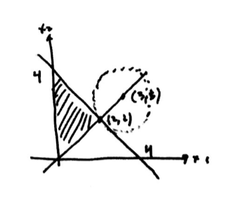
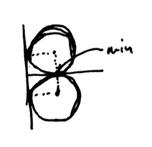

---
title:  'Nonlinear Optimization Lecture 11'
date: Thursday, February 18, 2016
author: Garrick Aden-Buie
...

# KKT Necessary Conditions

$$\begin{aligned}
\text{min}	&&&f(x)	& 	& \\
\text{s.t}	&&&g_i(x) \leq 0		&	&i = 1, \dots, m \\
\end{aligned}$$

$\bar x$ feasible with constrain qualifications -- $\nabla g_i (\bar x),\; i \in I$ are linearly independent.

If $\bar x$ is a local minimum, then KKT conditions state that $\exists u$ such that

$$\begin{aligned}
\nabla f(\bar x) + \sum_{i=1}^m u_i \nabla g_i(\bar x) &= 0 \\
u_i g_i(\bar x) &= 0 &&\forall i = 1, \dots, m \\
u_i &\geq 0
\end{aligned}$$

or in vector notation

$$\begin{aligned}
\nabla f(\bar x) + \nabla g(\bar x)^T u &= 0 \\
g(\bar x)^T u &= 0 \\
u &\geq 0
\end{aligned}$$

where $u$ is a vector of each $u_i$.

*Definition.* $u_i$ is called a *Lagrangian Multiplier* or a *dual variable*.

$$\begin{aligned}
\bar x \;\text{feasible} &\to \text{ Primal Feasibility} \\
\left.\begin{aligned} \nabla f(\bar x) + \nabla g(\bar x)^T u &= 0 \\ u &\geq 0 \end{aligned} \right\rbrace &\to \text{ Dual Feasibility} \\
g(\bar x)^T u = 0 &\to \text{ Complimentary Slackness}
\end{aligned}$$

## Example 1

$$\begin{aligned}
\text{min}	&&(x_1 - 3)^2 + (x_2 - 3)^2	&& 	& \\
\text{s.t}	&&&x_1^2 - x_2^2 &\leq 0 	&(u_1) \\
&&&x_1 + x_2 - 4 &\leq 0 &(u_2) \\
&&&-x_1 &\leq 0 &(u_3)\\
&&&-x_2 &\leq 0 &(u_4)\\
\end{aligned}$$

Fritz-John points: $\bar x \begin{bmatrix} 2 \\ 2 \end{bmatrix}$ and $I = \{1, 2\}$.

$$\begin{aligned}
u_0 + \nabla f(\bar x) + u_1 \nabla g_1(\bar x) + u_2 \nabla g_2(\bar x) &= 0 \\
\nabla f(x) &= \begin{bmatrix} 2(x_1 - 3) \\ 2(x_2 - 3) \end{bmatrix} \\
\nabla g_1(\bar x) &= \begin{bmatrix} 2x_1 \\ -2x_2 \end{bmatrix} \\
\nabla g_2(\bar x) &= \begin{bmatrix} 1 \\ 1 \end{bmatrix} \\
u_0 \begin{bmatrix} -2 \\ -2 \end{bmatrix} + u_1 \begin{bmatrix} 4 \\ -4 \end{bmatrix} + u_2 \begin{bmatrix} 1 \\ 1 \end{bmatrix} &= \begin{bmatrix} 0  \\ 0 \end{bmatrix} \\
u_0, u_1, u_2 &\geq 0 \\
(u_0, u_1, u_2) &\neq 0 \\
u_0 &= 1 \\
u_1 &= 0 \\
u_2 &= 2 \\
u_3 &= 0 \\
u_4 &= 0
\end{aligned}$$

Then $\bar x$ is a Fritz-John point.

What about $\bar x = \begin{bmatrix} 0 & 0 \end{bmatrix}^T$?
This is not a local minimum, but is it a Fritz-John point?
In this case, $I = \{1,3,4\}$, then

$$\begin{aligned}
u_0 \begin{bmatrix} -6 \\ -6 \end{bmatrix} + u_1 \begin{bmatrix}0\\ 0 \end{bmatrix} + u_3 \begin{bmatrix} -1 \\ 0 \end{bmatrix} + u_4 \begin{bmatrix} 0 \\ -1  \end{bmatrix} &= \begin{bmatrix} 0 \\ 0 \end{bmatrix} \\
u_0 = u_3 = u_4 &= 0 \\
u_1 &= 1 \\
u_2 &\in \mathbb{R}
\end{aligned}$$

$\bar x$ is  Fritz-John point, but it is not a local minimum (but still satisfies Fritz-John)

## Example 2

$$\begin{aligned}
\text{min}	&&&x_1	& 	& \\
\text{s.t}	&&&(x_1 - 1)^2 + (x_2 - 1)^2 - 1 &\leq 0		&	&(u_1) \\
          &&&(x_1 - 1)^2 + (x_2 + 1)^2 - 1 &\leq 0 &&(u_2)\\
\end{aligned}$$

This is a convex function and a convex set.

$$\begin{aligned}
\bar x &= \begin{bmatrix} 1 \\ 0 \end{bmatrix} \\
\bar x \;\text{local min} &\Rightarrow \bar x \;\text{F-J point} \\
\nabla f(x) &= \begin{bmatrix} 1 \\ 0 \end{bmatrix} \\
\nabla g_1(x) &= \begin{bmatrix} 2(x_1 - 1) \\ x(x_2 - 1) \end{bmatrix} \\
\nabla g_2(x) &= \begin{bmatrix} 2(x_1 - 1) \\ 2(x_2 + 1) \end{bmatrix} \\
u_0 \nabla f(\bar x) + u_1 \nabla g_1(\bar x) + u_2 \nabla g_2(\bar x) &=0 \\
u_0 \begin{bmatrix} 1\\ 0 \end{bmatrix} + u_1 \begin{bmatrix} 0 \\ -2 \end{bmatrix} + u_2 \begin{bmatrix} 0 \\ 2 \end{bmatrix} &= \begin{bmatrix} 0 \\ 0  \end{bmatrix} \\
u_0 = 0, u_1 = u_2 &=1 \\
\end{aligned}$$

### Compare with KKT Conditions

$$\begin{aligned}
\nabla f(\bar x) + u_1 \nabla g_1(\bar x) + u_2 \nabla g_2(\bar x) &=0 \\
u_1 g_1(\bar x) &= 0 \\
u_2 g_2(\bar x) &= 0 \\
u_1, u_2 &\geq 0 \\
\end{aligned}$$

We know that $g_1(\bar x) =0,\; g_2(\bar x) = 0$.

$$\begin{bmatrix} 1 \\ 0 \end{bmatrix} + u_1 \begin{bmatrix} 0 \\ -2 \end{bmatrix} + u_2 \begin{bmatrix} 0 \\ 2 \end{bmatrix} = \begin{bmatrix} 0 \\ 0  \end{bmatrix}$$

Where there is no solution.
So $\bar x$ is a Fritz-John point, but *not* a KKT point.
What's wrong is that $\begin{bmatrix} 0 & -2 \end{bmatrix}^T$ and $\begin{bmatrix} 0 & 2 \end{bmatrix}^T$ are not linearly independent, meaning that the constraint qualifications are not satisfied.

In this case, $S = \{(1,0)\}$ and $Int(S) = \emptyset$.

# Some constraint qualifications

1. $\nabla g_i(\bar x),\; i \in I$ are linearly independent
2. Slater's CQ for convex optimization problems: $Int (S) \neq \emptyset$
3. Abadie's CQ: constraints are all linear.

## Inequality and Equality

$$\begin{aligned}
\text{min}	&&&f(x)	& 	& \\
\text{s.t}	&&&g_i(x) \leq 0		&	&i = 1, \dots, m \\
          &&&h_j(x) = 0 &&j=1, \dots, l
\end{aligned}$$

**CQ:** $\nabla g_i(\bar x),\;\forall i \in I$ and $\nabla h_j(\bar x),\;\forall j = 1, \dots, l$ are linearly independent.

If $\bar x$ is a local minimum, then $\exists u, v$ such that
$$\begin{aligned}
\nabla f(\bar x) + \nabla g(\bar x)^T u + \nabla h(\bar x)^T v &= 0 \\
g(\bar x)^T u &=0 \\
u &\geq 0
\end{aligned}$$

**Necessary Conditions.** $\bar x$ a local min $\Rightarrow_{CQ}$ KKT conditions.

**Sufficient Conditions.** $\bar x$ local min $\Leftarrow_{?}$ KKT conditions (under some conditions).
So we are interested in: *under what conditions do the KKT conditions prove local minimum?*

- $f$ is pseudoconvex at $\bar x$
- $g_i$ is quasiconvex at $\bar x,\;\forall i \in I$ and $g_i(\bar x) = 0$
- $h_j$ is quasiconvex at $\bar x,\;\forall j$ such that $v_j > 0$
- $h_j$ is quasiconcave at $\bar x,\;\forall j$ such that $v_j < 0$

Sufficient conditions are satisfied when the above hold -- these are the minimum requirements.
