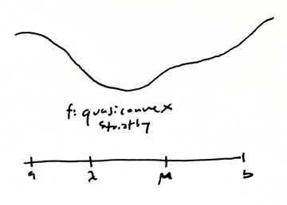
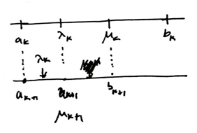

# Line Search without Derivative

$\min f(x)$, $f \colon \mathbb{R} \to \mathbb{R}$.
Let $f$ be strictly quasiconvex (monotonically decreasing, and then monotonically increasing).

Strictly quasiconvex function: $f(\lambda \bar x + (1 - \lambda)\hat x) < \max \lbrace f(\bar x), f(\hat x) \rbrace$, $\forall \lambda \in (0,1),\; f(\bar x) \neq f(\hat x)$.

## Theorem

(1) If $f(\lambda) \leq f(\mu)$, then $f(x) \geq f(\lambda)\;\forall x \in (\mu, b]$.

(2) If $f(\lambda) \geq f(\mu)$, then $f(x) \geq f(\mu)\;\forall x \in [a, \lambda)$.

Point (1) states that if $f(b)$ is highest and $f(\mu)$ and $f(\lambda)$ are lower (in that order), then the inflection point is definitely not between $\mu$ and $b$.
Point (2) says the same thing but on the side of $f(a)$, discarding the points between $a$ and $\lambda$.

*Proof.* Suppose not: assume $\exists \bar x \in (\mu, b]$ such that $f(\bar x) < f(\lambda)$.
Then $f(\lambda) < f(\mu) < f(\bar x) \leq f(b)$.
Consider the definition of strong quasiconvex functions:

$$\begin{aligned}
f(\mu) &< \max \lbrace f(\lambda), f(\bar x) \rbrace \\
&= f(\lambda)
\end{aligned}$$

But this is a contradiction.

## Dichotomous Search

*Intuition:* We would like to maximize the search area that is being abandoned in each step.
In the above line search if $\lambda, \mu, a, b$ are all highly separated, then each iteration discards a small portion of the search space.

Let

$$\begin{aligned}
\lambda_k &= \frac{a_k + b_k}{2} - \epsilon \\
\mu_k &= \frac{a_k + b_k}{2} + \epsilon
\end{aligned}$$

Step 0
:    Choose an interval $[a_1, b_1]$ that contains an optimal solution. Choose $\epsilon > 0, \delta > 0$. Set $k=1$.

Step 1
:    Compute $\lambda_k, \mu_k$.

Step 2
:    If $f(\lambda_k) < f(\mu_k)$ let $$\begin{aligned}a_{k+1} &= a_k \\ b_{k+1} &= \mu_k\end{aligned}$$.

    Otherwise, let $$\begin{aligned}a_{k+1} &= \lambda_k \\ b_{k+1} &= b_k\end{aligned}$$

Step 3
:    If $b_{k+1} - a_{k+1} < \delta$, then stop: $$x^* \tilde = \frac{a_{k+1} + b_{k+1}}{2}$$

    Otherwise, set $k = k+1$ and go to **Step 1**.

Note that we ned $\epsilon < \frac \delta 2$ for this to work.
But that this algorithm requires a significant number of function evalutions, which will add computation time.
This leads us to the next algorithm.

## Golden Section Search

In the previous algorithm, new function evaluations are needed for every point evaluated at every iteration.
In the golden section search, we want to re-use previous function evaluations, and only evaluate one new point at each search.

Position so that $\mu_{k+1} = \lambda_k$ or $\lambda_{k+1} = \mu_k$.

$$\begin{aligned}
\lambda_k &= \alpha a_k + (1 - \alpha) b_k \\
\mu_k &= (1 - \alpha) a_k + \alpha b_k
\end{aligned}$$

Find $\alpha$ so that $\mu_{k+1} = \lambda_k$

$$\begin{aligned}
\mu_{k+1} &= (1 - \alpha) a_{k+1} + \alpha b_{k+1} \\
&= (1 - \alpha) a_k + \alpha \mu_k \\
&= (1 - \alpha) a_k + \alpha((1 - \alpha)a_k + \alpha b_k) \\
&= (1 - \alpha^2)a_k + \alpha^2 b_k \\
\lambda_k &= \alpha a_k + (1 - \alpha) b_k
\end{aligned}$$

So we want $1 - \alpha^2 = \alpha \Rightarrow \alpha = \frac{-1 + \sqrt 5}{2} \approx 0.618$

If we do $n$ function evaluations the length of the interval is reduced by $(0.618)^{n-1}$.
Dichotomous search is only $\approx (0.5 - \epsilon)^{\frac n 2}$.
