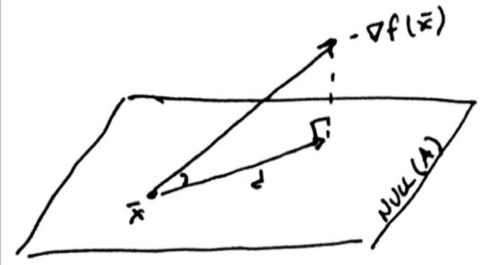

---
title:  'Nonlinear Optimization Lecture 16'
date: Tuesday, March 22, 2016
author: Garrick Aden-Buie
...

# Review

- KKT conditions
- Algorithms
    - Unconstrained optimization (Search Algorithms)
        - Single-dimension
        - Multi-dimension
            -  Cyclic search
            - Steepest Descent
            - others
    - Constrained Optimization
        - Penalty function
            - Where $\min f(x)$ s.t. $x \in X \Rightarrow \min \{ f(x) + \mu_k P(x)\}$
            - SUMT (Sequential Unconstrained Minimization Technique) by Fiacco and McCormick
            - $\{\mu_k\}$ is a strictly increasing sequence

# SUMT

Sequential Unconstrained Minimization Technique

Step 0
:    Choose $\mu_1 > 0, \beta > 1, \epsilon > 0$. Set $k = 1$

Step 1
:    Solve $\min f(x) + \mu_k P(x)$ to obtain $x^k$.

    *This step always starts with initial solution $x^{k-1}$ or an initial solution generated by another algorithm if starting from Step 0*.

Step 2
:    If $\mu_k P(x^k) < \epsilon$, stop.

    Otherwise, let $\mu_{k+1} = \beta\mu_k$, set $k = k+1$ and go to **Step 1**.

In other words, this algorithm starts outside the feasible region, and as $\mu_k$ is increased in each step, the solutions to each Step 1 converges to a point on the boundary of the feasible region.

# Barrier Functions

$$\begin{aligned}
\text{min}	&&&f(x)	& 	& \\
\text{s.t}	&&&x \in X		&	& \\
\end{aligned}$$

Define a barrier function $B(x)$ such that

i.  $B(x)$ continuous $\forall x$
ii.  $B(x) \geq 0\;\forall x \in Int(x)$
iii.  $B(x) \to \infty$ as $x \to \partial x$

*Examples.* $g_i(x) \leq 0 \Rightarrow -\frac{1}{g_i(x)}, \frac{1}{\{g_i(x)\}^2}, -\ln (- g_i(x))$

$$\begin{aligned}
\text{min}	&&&f(x) + \lambda_k B(x)	& 	& \\
\text{s.t}	&&&x \in X		&	& \\
\end{aligned}$$

where $\{\lambda_k\}$ is a strictly decreasing sequence with $\lambda_k \to 0$.

The algorithm process is analogous to the [SUMT](sumt) procedure.

Step 0
:    Choose $\lambda_1 > 0, \beta > 1, \epsilon > 0$. Set $k = 1$

Step 1
:    Solve $\min f(x) + \lambda_k B(x)$ to obtain $x^k$.

Step 2
:    If $\lambda_k B(x^k) < \epsilon$, stop.

    Otherwise, let $\lambda_{k+1} = \frac{1}{\beta}\lambda_k$, set $k = k+1$ and go to **Step 1**.

This algorithm works similarly to the SUMT, but it works from the interior of the feasible set and moves towards the boundary.
In the penalty function version, the solution $x^k$ at each iteration is always infeasible.
On the other hand, using the barrier function, $x^k$ is always feasible.

# Interior-Point Method

$$\begin{aligned}
\text{min}	&&&f(x)	& 	& \\
\text{s.t}	&&&h(x) = 0 &&\\
&&&x \geq 0		&	& \\
\end{aligned}$$

becomes

$$\begin{aligned}
\text{min}	&&&f(x) - \lambda \ln(-x)	& 	& \\
\text{s.t}	&&&h(x) = 0		&	& \\
\end{aligned}$$

(Primal-Dual Algorithm)

# Augmented Lagrangian

$$\begin{aligned}
\text{min}	&&&f(x)	& 	& \\
\text{s.t}	&&&h(x) = 0 &	& \\
&&&x \in \mathbb{R}^n
\end{aligned}$$

## Penalty Function

$$f(x) + \mu \sum_{i=1}^l \left\lbrack h_i(x) \right\rbrack^2 = f(x) + \mu h(x)^T h(x)$$

## Lagrangian Function

$$f(x) + \sum_{i=1}^l v_i h_i(x) = f(x) + v^T h(x)$$

Note that these two methods look similar, so let's try to combine them.
Combining the two gives the *augmented lagrangian function*.

## Augmented Lagrangian Function

$$L_A = f(x) + \mu h(x)^T h(x) + v^T h(x)$$

Given $\mu_k$ and $v^k$, find $x^k$ by solving

$$\begin{aligned}
\text{min}	&&&f(x) + \mu_k h(x)^T h(x) + {v^{k}}^{T} h(x)	& 	& \\
\end{aligned}$$

Update $\mu_k$ and $v^k$: $\mu_{k+1} > \mu_k$, but what about $v^k$?

If $x^k$ minimizes $L_A^k$, then $\nabla L_A^k(x^k) = 0$.

$$\begin{aligned}
\nabla L_A^k(x^k) &= \nabla f(x^k) + 2\mu_k h(x^k)^T\nabla h(x^k) + (v^k)^T \nabla h(x^k) \\
&= \nabla f(^k) + \left\lbrack 2 \mu_k h(x^k) + v^k \right\rbrack^T \nabla h(x^k) \\
&= 0
\end{aligned}$$

Note that if we let $v^{k+1} = \mu_k h(x^k) + v^k$ that from the KKT conditions we know that we should get $\nabla f(x) + v^T \nabla h(x) = 0$.

This process repeats until a convergence test is passed, the most popular of these being $\Vert x^{k+1} - x^k \Vert < \epsilon$ or $\Vert v^{k+1} - v^k \Vert < \epsilon$

# Gradient Projection

Recall that *steepest descent* is $x^{k+1} = x^k - \lambda_k \nabla f(x^k)$.

$$\begin{aligned}
\text{min}	&&&f(x)	& 	& \\
\text{s.t}	&&&x \in X		&	& \\
\end{aligned}$$

Note that with the steepest descent algorithm, it's possible that $x^{k+1}$ is infeasible.
The goal of *gradient projection* is to follow the gradient, but to project back onto $X$ to stay feasible.

$$\begin{aligned}
x^{k+1} &= P_x \left\lbrack x^k - \lambda_k \nabla f(x^k) \right\rbrack \\
&= \arg\min_{x \in X} \left\Vert x - (x^k - \lambda_k \nabla f(x^k)) \right\Vert^2
\end{aligned}$$

$\lambda_k$ needs to be sufficiently small and decreasing, often used is $\lambda_k = \frac 1 k$.

## Example: Linear Equality Constraints

$$\begin{aligned}
\text{min}	&&&f(x)	& 	& \\
\text{s.t}	&&&Ax = b		&	& \\
\end{aligned}$$

Let $\bar x$ be a feasible solution with $A\bar x = b$.
Find an improving feasible direction at $\bar x$.

*Feasible.* Choose a feasible $\bar x + \lambda d$ such that $A(\bar x + \lambda d) = b$, which can be written as $A\bar x + \lambda A d = b$ or $Ad = 0$ (since $A\bar x = b$).
So from this we know that $d$ needs to lie in the null space of $A$ (i.e. $Ad = 0$).

*Improving.* $\left\lbrack - \nabla f(\bar x) \right\rbrack^T d > 0$.

$$\begin{aligned}
\min_d	&&&\frac 1 2 \Vert d - (- \nabla f(\bar x)) \Vert^2 = \frac 1 2 (d + \nabla f(\bar x))^T (d + \nabla f(\bar x))	& 	& \\
\text{s.t}	&&&Ad = 0		&	& \\
\end{aligned}$$

KKT conditions state that $d + \nabla f(\bar x) + v^T A = 0$ and $v$ free.
Multiplying this by $A$ gives

$$\begin{aligned}
Ad + A\nabla f(\bar x) + A A^T v &= 0 \\
v &= - (A A^T)^{-1}A \nabla f(\bar x)
\end{aligned}$$

noting that $Ad = 0$. $A$ is not necessarily symmetric, but should be full rank.

$$\begin{aligned}
d &= - \nabla f(\bar x) - v^T A \\
&= \left\lbrack I - A^T(A A^T)^{-1} A \right\rbrack (-\nabla f(\bar x)) \\
P &= \left\lbrack I - A^T(A A^T)^{-1} A \right\rbrack
\end{aligned}$$

Where $P$ is, in this case only, the projection matrix.
