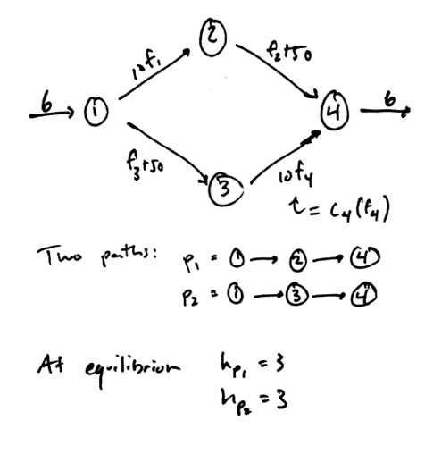

---
title:  'Nonlinear Optimization Lecture 25'
date: Thursday, April 21, 2016
author: Garrick Aden-Buie
...

# Continuing from last class

$$\Omega = \{ h \colon \geq 0, \sum_{p \in P_{ij}} h_p = T_{ij} \;\forall (i,j) \in W \}$$

## UE $\Rightarrow$ VI

$$\begin{aligned}
h^* &\in \Omega \\
\sum_{p \in P} c_p(h^*)(h_p - h_p^*) &\geq 0 \;\forall h \in \Omega \\
\end{aligned}$$

## VI $\Rightarrow$ UE

$$\begin{aligned}
\sum_{p \in P} c_p (h^*) h_p &\geq \sum_{p \in P} c_p (h^*) h_p^* &&\forall h \in \Omega &&\Rightarrow h^* = \arg\min_{h \in \Omega} \sum c_p(h^*)h_p\\
\end{aligned}$$

VI: for $x^* \in X \colon \sum c_i x_i \geq \sum c_i x_i^* \;\forall x \in X \Rightarrow x^* = \arg\min_{x \in X} \sum c_i x_i$.

Here, you do not know what $h^*$ is, but if you did, you could construct the minimization problem above.
You can't solve the problem because you don't know what $h^*$ is, but we'll suppose we could and then we'll derive some optimality conditions that will be instructive.

$$\begin{aligned}
h^* =\arg\min	&&&\sum c_p(h^*)h_p	& 	& \\
\text{s.t}	&&&T_{ij} - \sum_{p \in P_{ij}}h_p = 0		&	&\forall(i,j) \in W &&(u_{ij})\\
            &&&-h_p \leq 0 &&\forall p \in P &&(\rho_p) \\
\end{aligned}$$

*Remark.* If the VI is $\geq 0$ then it is related to maximization problem; if the VI is $\leq 0$ then it is related to minimization.

Now, we derive the KKT conditions, using the dual variables (in parens above), where we are assuming that $h^*$ is fixed.

### KKT

$$\begin{aligned}
c_p(h^*) - u_{ij} - \rho_p &= 0 &&\forall (i,j) \in W, p \in P_{ij} \\
(-h_p)(\rho_p) &= && \forall p \in P \\
\rho_p &\geq 0 && \forall p \in P
\end{aligned}$$

Note that $h_p$ is the variable that needs to be minimized in the above problem, and that $h^*$ is free/fixed.
And from the VI formulation, we know that $h^*$ and $h_p$ need to be the same.

The KKT conditions give:

$$\begin{aligned}
\rho_p &= c_p(h^*) - u_{ij} \\
\Rightarrow h_p^* \left( c_p(h^*) - u_{ij} \right) &= 0 \\
h_p^* &\geq 0 \\
c_p(h^*) - u_{ij} &\geq 0 \\
T_{ij} - \sum_{p \in P_{ij}} h_p &= 0 \\
\end{aligned}$$

Summary: we started with the VI problem, reformulated as an LP problem (that we can't solve, but is useful), from which we obtain user equilibrium.
It's a lot like magic.

**Key lesson:** VI is equivalent in both directions to UE, so as long as we have a solution to the VI, then we have an equilibrium flow.
The nice thing about the VI is that you don't need the $u_{ij}$, which as we see in the VI $\Rightarrow$ UE proof is hidden as a dual variable in the VI problem.

*Another side note.* If $VI(F, \Omega)$ and $\Omega = \mathbb{R}^+$, then equivalent to $NCP(F, \Omega)$. So in this case: $VI(F, \Omega) \Rightarrow KKT \Rightarrow NCP(\square, \square)$.

# System optimum

So far we have been considering problems where the benefits to individual actors is maximized.
But what if we were to look at the overall system optimization, what is best for the entire system and not the players?

$$\begin{matrix}
\begin{aligned}
\text{min}	&&&\sum_{p \in P} c_p (h) h_p	& 	& \\
\text{s.t}	&&&h \in \Omega		&	& \\
\end{aligned}
&\begin{aligned}\Rightarrow \\ \\ \end{aligned}
&\begin{aligned}
\sum_{p \in P} \left\lbrack c_p(h^{so}) + \frac{\partial c_p(h^{so})}{\partial h_p} \right\rbrack (h_p - h_p^{so}) \geq 0 \;\forall h \in \Omega \\
\\
\end{aligned}
\end{matrix}$$

Here, $h_p^{so}$ indicates the system optimal point.

## Example: System Optimum vs User Equilibrium

Two paths: $p_1$ and $p_2$ with equilibrium $h_{p_1} = 3$ and $h_{p_2} = 3$.
The *travel cost* is $p_1 \colon (10 \times 3) + (3 + 50) = 83$ and $p_2 \colon (3 + 50) + (10 \times 3) = 83$.
The *total cost* is $83 \times 3 + 83 \times 3 = 498$.
In this example $h^{UE} = h^{SO}$.

What if we add another arc from 2 to 3 with $c_5(f_5) = f_5 + 10$?
Then there is a third path: $p_3 \colon 1 \to 2 \to 3 \to 4$.

The new UE is $h_{p_1} = h_{p_2} = h_{p_3} = 2$.
The path travel cost is now 92 for each path, and the total cost is $3 \times (92 \times 2) = 552$.

Note that *total travel cost increased* when we added a new path!
If we were investing in road construction, this would not be a good thing.
This is called the *Braess Paradox*: adding arcs to a network does not guarantee an improvement in the total travel time.

But, note that in this case, the SO flow would be the same as previously, $h_{p_1} = h_{p_2} = 3, h_{p_3} = 0$.

# Price of Anarchy

**Price of anarchy** $= \frac{TC^{UE}}{TC^{SO}}$, or the ratio of total cost under UE to total cost under SO.

It has been shown that if $c_a$ is a linear function, then the Price of Anarchy is bounded, and is $\leq \frac{4}{3} = 1.33\bar 3$.
This was proven by Tim Roughgarden, who wrote a dissertation on this topic.
